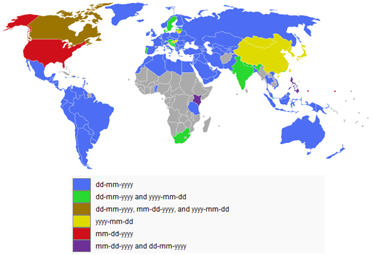

# introduzione (Alex)

Il tempo zero dell'Informatica non inizia con la data di nascita di Gesù Cristo o di chi per lui ma dalla mezzanotte di giovedi 1 gennaio 1970.
Ma perchè venne scelto il 1970? I sistemi UNIX vennero progettati nel 1969, il primo pubblicato nel 1971 quindi si suppose che nessun sistema informatico avrebbe potuto rappresentare un tempo di sistema prima di questa data.

La classe Date ci permette di lavorare con le date, confrontarle e compiere semplici operazioni.

Per la rappresentazione di date e orari JavaScript prevede l'oggetto Date. Esso codifica internamente una data come il numero di millisecondi trascorsi dal 1 Gennaio 1970, ora di Greenwich.

---

Script dimostrativo

---

## Formattazione (riccio)

La formattazione e' il formato stesso della data, come viene scritto ed utilizzato.

La necessità di uno standard nasce dal fatto che la data formulata come 04-09-03 può indicare il:

    - 4 settembre 2003 (o addirittura 1903) in Europa e altri Paesi,
    - 9 aprile 2003 negli Stati Uniti d'America,
    - 3 settembre 2004 secondo lo standard ISO 8601.[1]

Per sopperire alle problematiche relative ai diversi tipi di data nel mondo l' ISO(International Standard Organization) per la prima volta il 15 Giugno del 1988 uniforma diversi standard di formattazione oraria .

L' attuale protocollo adottato e' quello del 3 Dicembre 2004, in generale assume che i valori delle date siano organizzati dal piu' significativo al meno, il numero delle cifre per i valori deve essere costante, ad esempio 2 cifre per mesi e giorni e 4 per gli anni (non potremmo scrivere quindi 6-6-96 ma 06-06-1996).

I parametri vanno inseriti "A cascata": 

- AAAA-MM-GG-HH-MM-SS

### Tipi di formattazione

- Little-endian (cioè giorno/mese/anno)

sono date valide 02/04/2021 e 02 aprile 2021. 

- Middle-endian (cioè mese/giorno/anno) - Stati Uniti

sono date valide 04/02/2021 e Aprile 02, 2021.

- Big-endian (cioè anno/mese/giorno) Cina/Corea/Iran

sono date valide 2021/04/02 e 2021 Aprile 02 (anche se quest’ultima è veramente molto rara da vedere)

### La formattazione su JS

Gli sviluppatori Javascript sanno che manipolare date non è cosi semplice come si pensa. Oltre ai sopracitati problemi di formati data e ora, bisogna considerare le differenze di fuso orario e localizzazione.

L’oggetto Date in Javascript è l’elemento principale quando si tratta di gestire data e ora.
La data viene memorizzata come un numero espresso in millisecondi trascorsi dal 1 gennaio 1970 00:00:00 (UTC - Universal Time Coordinated / GMT - Greenwich Mean Time). 

L'oggetto Date ha sette metodi di formattazione, ognuno dei quali restituisce un valore specifico:

---

Script dimostrativo

---

## Metodi (Ludo)

L'oggetto Date prevede una serie di metodi che consentono di scomporre una data nei suoi componenti.

**1. Metodo Get**

È possibile recuperare il valore di una data utilizzando i metodi elencati:

- getFullYear()
Restituisce l'anno rappresentato con quattro cifre
- getMonth()
Restituisce il mese (da 0 a 11)
- getDate()	
Restituisce il giorno del mese (da 1 a 31)
- getDay()
Restituisce il giorno della settimana (da 0 a 6)
- getHours()
Restituisce l'ora
- getMinutes()
Restituisce i minuti
- getSeconds()
Restituisce i secondi
- getMilliseconds()
Restituisce i millisecondi

**2. Metodo Set**

È possibile modificare il valore di una data utilizzando i metodi elencati:

- setFullYear()	
Imposta l'anno di una data
- setMonth()
Imposta il mese di una data
- setDate()	
Imposta il giorno del mese di unadata
- setHours()
Imposta l'ora di una data
- setMinutes()
Imposta i minuti di una data
- setSeconds()
Imposta i secondi di una data
- setMilliseconds()	
Imposta i millisecondi di una data
- setTime()
Imposta data e ora specificandola in millisecondi rispetto al 1 Gennaio 1970

**Tips:** Utilizzando l' acronimo UTC internamento a Get e la desinenza possiamo ottenere l' ora di greenwich:

- getUTCHours()

---

Script dimostrativo

---

## Operatori (Giovanni)

JavaScript prevede la possibilità di confrontare due date tramite i normali operatori di confronto.

---

Script dimostrativo

---